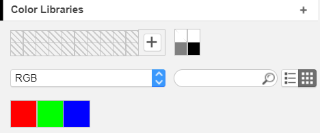
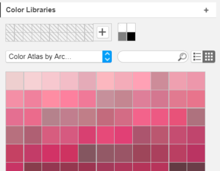

Colors is how you manage the color resources in your garments. Use the Colors API to create your own color library, add a color library from an existing Adobe color library, and so on.

For more information about the feature, please visit <a href="https://support.browzwear.com/VStitcher/Materials/color-libs.htm" target="_blank">here</a>.

To learn more about the rest of the API, please refer to <a href="https://gitlab.com/browzwear/share/open-platform/client-api/-/blob/master/BWPlugin/include/AssetManagement/BWPluginAPI_Color.h" target="_blank">Color</a> in the repository.

## Sample Plugin
Sample plugin for the color library is available <a href="https://gitlab.com/browzwear/share/open-platform/client-api/-/tree/master/samples/python/color-library" target="_blank">here</a>

## Creating a Color Library
### Code Snippet
Browzwear allow you to programmatically add a new color library to the Browzwear's app.
The API for creating a new color library receives a JSON (as a string) that contains all the information and colors for this library. For more information, refer to: schema/color/color-lib.json

<!--DOCUSAURUS_CODE_TABS-->

<!--Python-->

```python
import BwApi
# assuming colorLibJson contains the above color library
colorLibId = BwApi.ColorLibraryCreate(garmentId, colorLibJson)
```
<!--C++-->
```cpp
// assuming colorLibJson contains the above color library
int colorLibId = 0;
BwApiColorLibraryCreate(garmentId, colorLibJson, &colorLibId);
```
<!--C#-->
```csharp
// assuming colorLibJson contains the above color library
int colorLibId = 0;
BwApi.ColorLibraryCreate(garmentId, colorLibJson, out colorLibId);
```
<!--END_DOCUSAURUS_CODE_TABS-->

<br/>

### Result


## Adding an existing Color Library
You can also add an existing color library from file. Browzwear support Adobe files (.ASE, .ACO) and JSON color library which is compatible with the color-lib <a href="https://gitlab.com/browzwear/share/open-platform/client-api/-/blob/master/BWPlugin/schema/api/v1.0/color/color_lib.json" target="_blank">schema</a>.

Note: the filename will be used as a library name (so filename must be unique)

### Code Snippet

<!--DOCUSAURUS_CODE_TABS-->

<!--Python-->


```python
# assuming colorLibPath contains path to a color library file (.ase, .aco or .json).
colorLibId = BwApi.ColorLibraryAdd(garmentId, colorLibPath)
```
<!--C++-->
```cpp
// assuming colorLibPath contains path to a color library file (.ase, .aco or .json).
int colorLibId = 0;
BwApiColorLibraryAdd(garmentId, colorLibPath, &colorLibId);
```
<!--C#-->
```csharp
// assuming colorLibPath contains path to a color library file (.ase, .aco or .json).
int colorLibId = 0;
BwApi.ColorLibraryAdd(garmentId, colorLibPath, out colorLibId);
```
<!--END_DOCUSAURUS_CODE_TABS-->
<br/>

### Result


## Getting Colors from a Library
Like as you can set the colors when creating a library you can get  from an existing library. 

### Code Snippet

<!--DOCUSAURUS_CODE_TABS-->

<!--Python-->
```python
colors = BwApi.ColorLibraryGetColors(garmentId, colorLibId)
```
<!--C++-->
```cpp
BwString colors;
BwApiColorLibraryGetColors(garmentId, colorLibId, colors);
```
<!--C#-->
```csharp
BwApiString colors = new BwApiString();
BwApi.ColorLibraryGetColors(garmentId, colorLibId, out colors);
```
<!--END_DOCUSAURUS_CODE_TABS-->
<br/>

### Result
JSON object as a string that represent a list of color objects within the given library.<br> see <a href="https://gitlab.com/browzwear/share/open-platform/client-api/-/blob/master/BWPlugin/schema/api/v1.0/color/color.json" target="_blank">schema</a>. 
