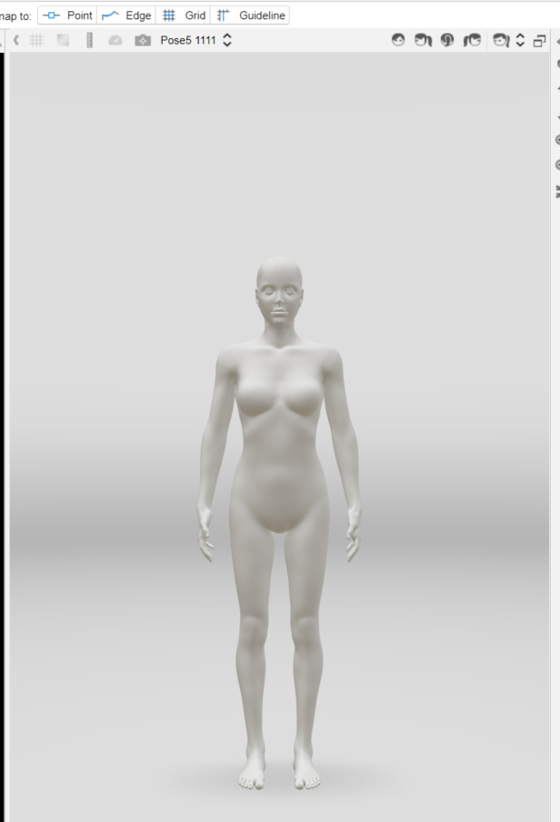
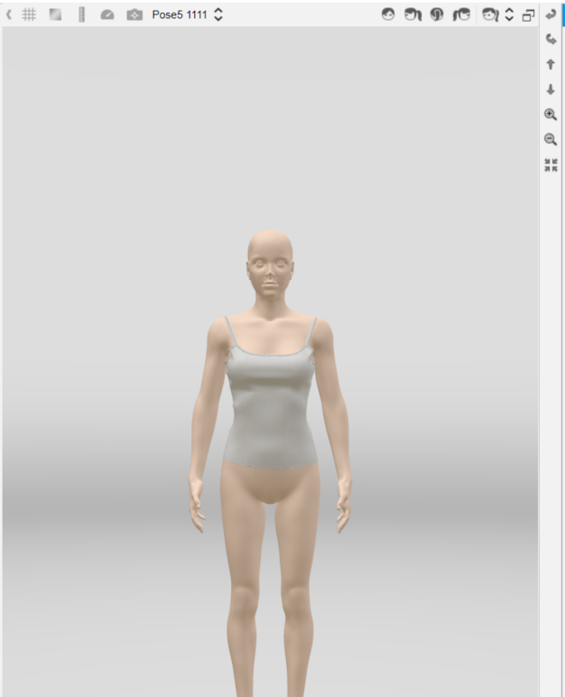

Dress is how you drape a garment over an avatar. Use the Garment API to dress a garment, add iterations to a simulation and so on. 

For more information about the feature, please visit <a href="For more information about the feature, please visit <a href="https://support.browzwear.com/VStitcher/Basic/dressing-vs.htm" target="_blank">here</a>.

To learn more about the rest of the API, please refer to <a href="https://gitlab.com/browzwear/share/open-platform/client-api/-/blob/master/BWPlugin/include/CAD/BWPluginAPI_Garment.h.h" target="_blank">Garment</a> in the repository.

## Sample Plugin
Sample plugin for garment creation is available <a href="https://gitlab.com/browzwear/share/open-platform/client-api/-/tree/master/samples/python/SamplePluginPython" target="_blank">here</a>

## Setting Current Avatar

### Code Snippet

<br/>
<!--DOCUSAURUS_CODE_TABS-->

<!--Python-->
```python
# assuming avatarId is a valid avatar id in the system
BwApi.AvatarCurrentSet(avatarId)
```
<!--C++-->
```cpp
// assuming avatarId is a valid avatar id in the system
BwApiAvatarCurrentSet(avatarId);
```
<!--C#-->
```csharp
// assuming avatarId is a valid avatar id in the system
BwApi.AvatarCurrentSet(avatarId);
```
<!--END_DOCUSAURUS_CODE_TABS-->

<br/>

### Result



## Dress Garment

### Code Snippet
The code snippet below shows how to start garment dress simulation on the current avatar. 

<!--DOCUSAURUS_CODE_TABS-->

<!--Python-->

```python
BwApi.GarmentDress(garmentId)
```
<!--C++-->

```cpp
BwApiGarmentDress(garmentId);
```
<!--C#-->

```csharp
BwApi.GarmentDress(garmentId);
```
<!--END_DOCUSAURUS_CODE_TABS-->

### Result

