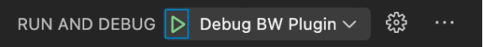

## Prerequisites
Install Python 3.7.8 if you do not already have it installed. </br>

## Basic plugin
You can build your first plugin with a few simple steps:
1. Download this boilerplate.
2. Update the plugin.json with your plugin's identifier and name
3. [Add the plugin](Development) to your app.

That's it! Now you'll see your plugin under the "Plugins" tab. <br>
Follow the "TODO" in "main.py" to configure your plugin


## Debug your plugin using Visual Studio Code

### Prerequisites

- VStitcher or Lotta **2021.2.0** or newer installed
- Visual Studio Code installed
- You have a working plugin which you would like to debug
- You have added the plugin to VStitcher or Lotta

### Install debugpy Library
Open terminal and run the following commands.

Windows:
```
cd {YOUR PLUGIN FOLDER - where plugin.json is located}
"%programfiles%\Browzwear\VStitcher\2021.1\python\bin\python.exe" -m pip install debugpy -t ./lib
```

Mac:
```
cd {YOUR PLUGIN FOLDER - where plugin.json is located}
"/Applications/Browzwear/VStitcher 2021.1.app/Contents/Resources/python/bin/python3.7" -m pip install debugpy -t ./lib
```

debugpy is downloaded to your {plugin source folder}/lib


### Prepare Visual Studio Code
First, create the launch.json configuration file as described here: https://code.visualstudio.com/docs/python/debugging#_initialize-configurations

Then, enter the following in the launch.json file.
``` JS
{
  "version": "0.2.0",
  "configurations": [{
    "name": "Debug BW Plugin",
    "type": "python",
    "request": "attach",
    "connect": {
      "host": "localhost",
      "port": 5678
    }
  }]
}
```

### Modify the Plugin Code

To be able to debug the plugin you need to change the plugin so that it uses debugpy.
To change the plugin:

1. Add the plugin folder to Visual Studio Code.
2. Within your BwApiPluginInit implementation add the following code.
``` PY
# add the lib folder to sys.path
import sys
sys.path.append(os.path.join(os.path.dirname(__file__), '..', 'lib'))

import debugpy
# 5678 is the default attach port in the VS Code debug configurations. Unless a host and port are specified, host defaults to 127.0.0.1
# for further information see https://code.visualstudio.com/docs/python/debugging#_debugging-by-attaching-over-a-network-connection

if sys.platform == 'win32':
    debugpy.configure(python=os.path.join(sys.base_exec_prefix, 'bin', 'python.exe'))
 else:
    debugpy.configure(python=os.path.join(sys.base_exec_prefix, 'bin', 'python3.7'))

debugpy.listen(5678)
print("Waiting for debugger attach")
debugpy.wait_for_client()
debugpy.breakpoint()
print('break on this line')
```

### Run VStitcher With Option to Debug Plugins

Now run VStitcher with the --plugin-sandbox argument.

Windows:
`"%programfiles%\Browzwear\VStitcher\2021.1\VStitcher.exe" --plugin-sandbox`

Mac:
`"/Applications/Browzwear/VStitcher 2021.1.app/Contents/MacOS/VStitcher" --plugin-sandbox`

### Debug the Plugin

1. Open VStitcher. VStitcher hangs and waits for the debugger to attach.
2. Go back to Visual Studio Code and click the Debug tab.


3. Click the green debug button next to Debug BW Plugin.

The debugger should now connect to your plugin and stop at the debugpy.breakpoint line.

4. Use Visual Studio Code to add breakpoints and debug your plugin.

### Deploying the Plugin

The argument **--plugin-sandbox** sets all plugins to work on the same python interpreter. This may cause security issues, but does allow the plugin to be debugged.

Whoever uses the plugin will run the plugin without that argument. Therefore, it’s the developer’s responsibility to check, before deploying the plugin, that it will work without --plugin-sandbox.  