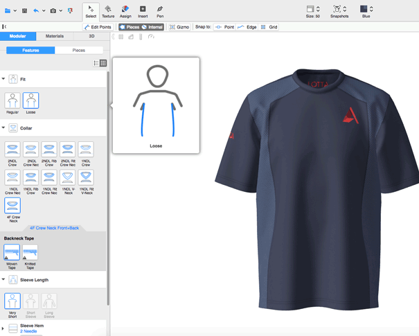

Browzwear SmartDesign features Smart Templates, which include silhouettes, trims, colors, and workmanship of each brand’s factories. 
Using a powerful Template Configurator, brands can create customized templates based on their own blocks.

By compiling all the information, a single file powers a large variety of design decisions in one business package.

For full documentation, refer to 'BWPluginAPI_SmartTemplate.h' in the plugin pack.

**Note: You need to have a smart template license in order to use this feature**

**Note2: For the ease of explanation, a Python code snippet is shown, but everything can be done in both C++ and C# as well.** 



## Smart Template API Models
### Category
Category represents the smart template category. For more information, refer to: app installation folder\Resources\schema\v1\smart_template_category.json

### Nested Category
Nested category is a child category within an existing category. The schema of this object is the same as [Category](#category) schema

### Category Item
Category Item model represents the smart template category type. For more information, refer to: app installation folder\Resources\schema\v1\smart_template_category_item.json

## Create a Smart Template Garment

### Code Snippet
In order to start working on a smart template, you first need to configure the garment as a smart template garment. In the UI this is done via the `Configure` button. In the API, you use the `SmartTemplateGarmentSet` function.

```python
garmentId = BwApi.GarmentId()

# set the garment as smart template garment if necessary
if not BwApi.SmartTemplateGarmentGet(garmentId):
  BwApi.SmartTemplateGarmentSet(garmentId)
```

## Create a Smart Template Category

### Code Snippet

```python
categoryId = BwApi.SmartTemplateCategoryAdd(garmentId, parentCategoryId, categoryJSON)
```
You can find the schema for categoryJSON <a href="https://gitlab.com/browzwear/share/open-platform/client-api/-/blob/master/BWPlugin/schema/api/v1.0/smart-template/smart_template_category.json" target="_blank">here</a>


## Create a Smart Template Category Item 

### Code Snippet
```python
categoryItemId = BwApi.SmartTemplateCategoryItemAdd(garmentId, categoryId, categoryItemJSON)
```
You can find the schema for categoryItemJSON <a href="https://gitlab.com/browzwear/share/open-platform/client-api/-/blob/master/BWPlugin/schema/api/v1.0/smart-template/smart_template_category_item.json" target="_blank">here</a>
